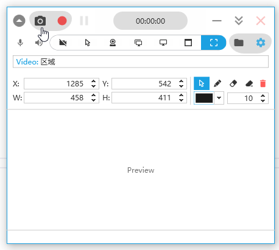
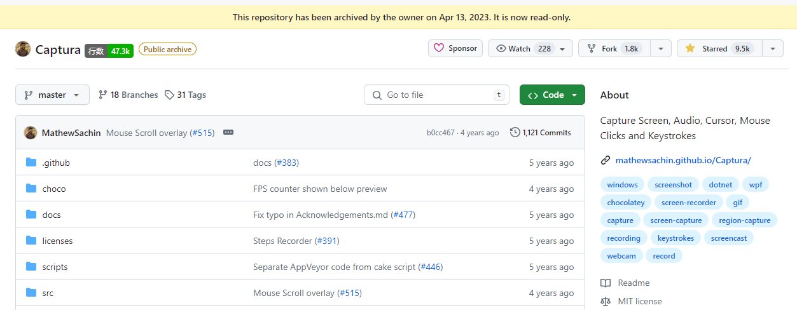

&copy; [Copyright 2019](mathew/LICENSE_MathewSachin.md) Mathew Sachin  
&copy; [Copyright 2024](LICENSE.md) Mr. Chip  
&copy; [Copyright 2025](LICENSE.md) grandixximo

Capture Screen, WebCam, Audio, Cursor, Mouse Clicks and Keystrokes.

## About This Project

**OSR Studio** is a complete rebrand of the excellent screen recording software originally known as Captura. This project builds upon the foundation laid by its predecessors while establishing a fresh identity for better visibility and continued development.

### Origins & Credits

The original [Captura](https://github.com/MathewSachin/Captura) was created by **Mathew Sachin** - an exceptional tool that was small, portable, and just worked perfectly. When the original project was discontinued, [Mr. Chip (mrchipset)](https://github.com/mrchipset/nCaptura) maintained an excellent fork (nCaptura) that kept the project alive and functional.

OSR Studio continues this legacy with important enhancements:

- ✅ Fixed the FFmpeg download window initialization issue
- ✅ Updated FFmpeg download mirrors to ensure reliability
- ✅ Improved build and release workflows
- ✅ Added AMD AMF hardware encoding support (inspired by OBS Studio)
- ✅ Implemented Windows Graphics Capture (WGC) for reliable screen recording (Windows 10 1903+)
- ✅ Complete rebrand for better project visibility

**Huge thanks to:**
- **Mathew Sachin** - Original creator of Captura, the foundation of this project
- **Mr. Chip (mrchipset)** - Excellent maintainer who kept the project alive with nCaptura
- **Cursor & Claude** - AI tools that made these enhancements possible

## Features

- Take ScreenShots
- Capture ScreenCasts (Avi/Gif/Mp4)
- Capture with/without Mouse Cursor
- Capture Specific Regions, Screens or Windows
- Capture Mouse Clicks or Keystrokes
- Mix Audio recorded from Microphone and Speaker Output
- Capture from WebCam.
- Can be used from [Command-line](https://mathewsachin.github.io/Captura/cmdline) (*BETA*).
- Available in [multiple languages](https://mathewsachin.github.io/Captura/translation)
- Configurable [Hotkeys](https://mathewsachin.github.io/Captura/hotkeys)

## Installation

[latest]: https://github.com/grandixximo/osr-studio/releases/latest

Portable and Setup builds for the latest release can be downloaded from [here][latest].

**Choose one:**
- **Installer** (`OSR-Studio-Setup.exe`) - Recommended for most users
- **Portable** (`OSR-Studio-Portable.zip`) - No installation required

### Build from Source

See the [Build Notes](docs/Build.md) for instructions on building from source.

## Docs
[Build Notes](docs/Build.md) | [System Requirements](docs/System-Requirements.md) | [Contributing](CONTRIBUTING.md)

[ScreenShots](docs/Screenshots) | [Command-line](docs/Cmdline/README.md) | [Hotkeys](https://mathewsachin.github.io/Captura/hotkeys)

[FAQ](docs/FAQ.md) | [Code of Conduct](CODE_OF_CONDUCT.md) | [Changelog](docs/Changelogs/README.md)

[Continuous Integration](docs/CI.md) | [FFmpeg](docs/FFmpeg.md)

## License

[MIT License](LICENSE.md)

Check [here](licenses/) for licenses of dependencies.
